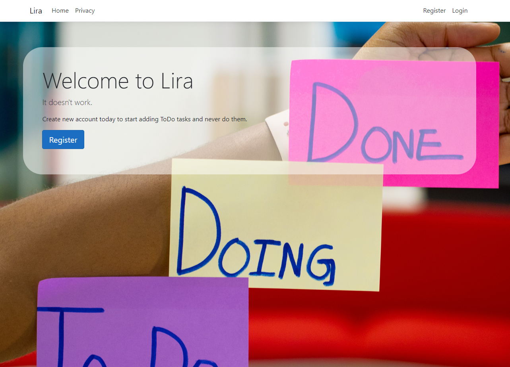
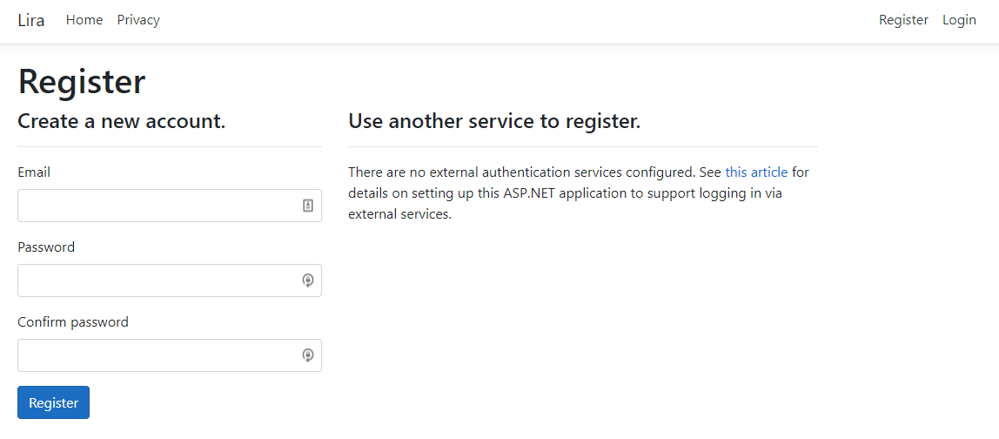
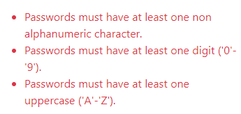
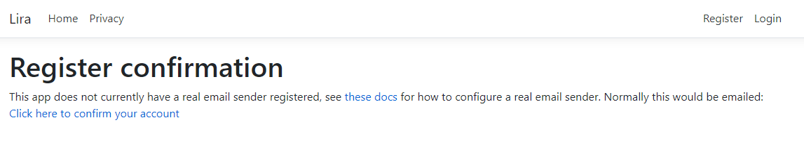
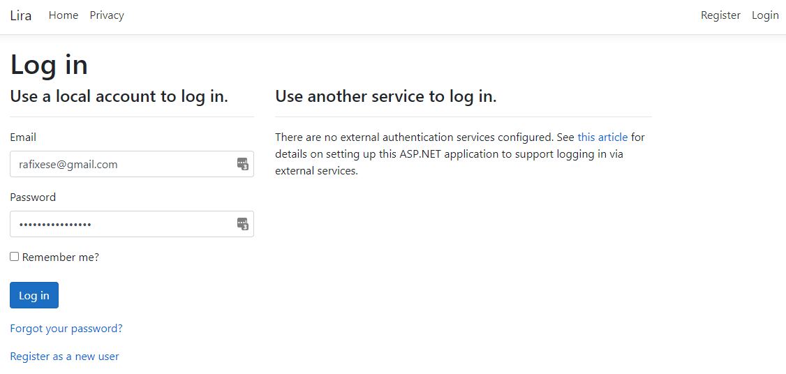
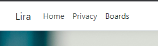
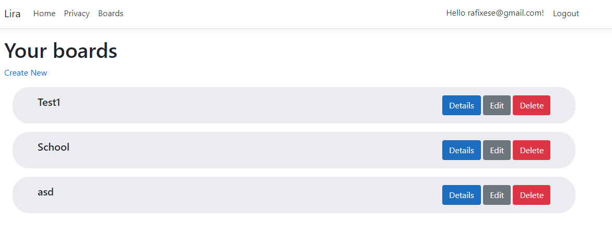
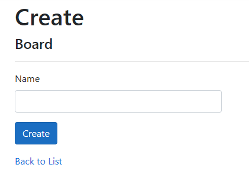
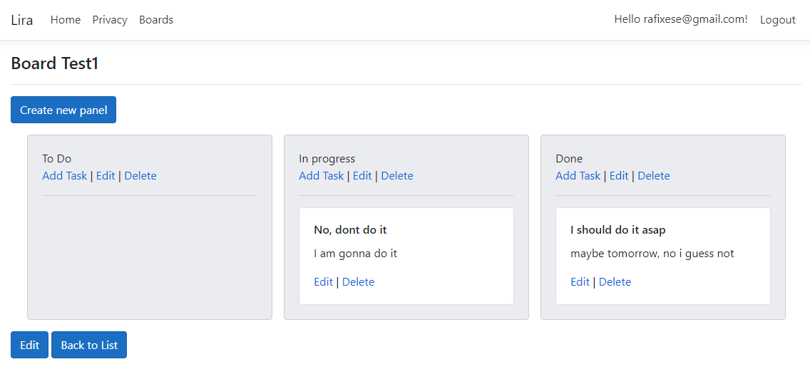

# LIRA
Lira to klon aplikacji Trello. W większości funkcji został uproszczony na
potrzeby zajęć. Jest to aplikacja do zarządzania zadaniami i przerzucaniu
ich pomiędzy kolumnami np. ToDo, In progress i Done.

## Spis treści

1. [Opis funkcjonalności](#opis-funkcjonalności)
   1. [Strona główna](#strona-gwna)
   2. [Rejestracja](#rejestracja)
   3. [Logowanie](#logowanie)
   4. [Tablice](#boards)
   5. [Widok tablicy](#board)
2. 

## Opis funkcjonalności 
### Strona główna 

Strona główna wita nas praktycznie niczym, oprócz jumbotronu z 
przyciskiem do rejestracji użytkownika

### Rejestracja 

Widok rejestracji to podstawowy formularz. Użytkownik musi wypełnić
swój e-mail i hasło w celu kontynuacji.

Hasło musi być odpowiednio złożone.

Użytkownik po rejestracji zostanie poproszony o potwierdzenie adresu
email.

### Logowanie 

W widoku logowanie użytkownik jest proszony o podanie adresu email i
hasła. Również funkcjonalny jest przycisk "Remember me", który pozwala
na zachowanie sesji.

Po zalogowaniu w panelu nawigacyjnym staje się dostępna dostępny link
do tablic użytkownika.

### Tablice 
Strona Boards prezentuje listę tablic użytkownika, wraz z przyciskami
służącymi do przejścia do danej tablicy, edycji czy usunięcia tablicy.

Użytkownik może dodawać nowe tablice wykorzystując przycisk 
"Create New".

### Widok tablicy 

Tablica składa się z paneli, które definiuje użytkownik. Każdy panel
zawiera zadania, które stworzył użytkownik. Zadania można przenosić
pomiędzy panelami poprzez chwycenie i przeciągnięcie zadania do
odpowiedniego panelu.

Strona tablicy zawiera przycisk do tworzenia nowych paneli oraz każdy
panel jest zaopatrzony w 3 przyciski pozwalające na tworzenie, 
edytowanie i usuwanie zadań.